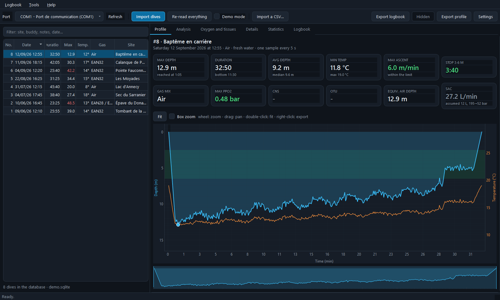
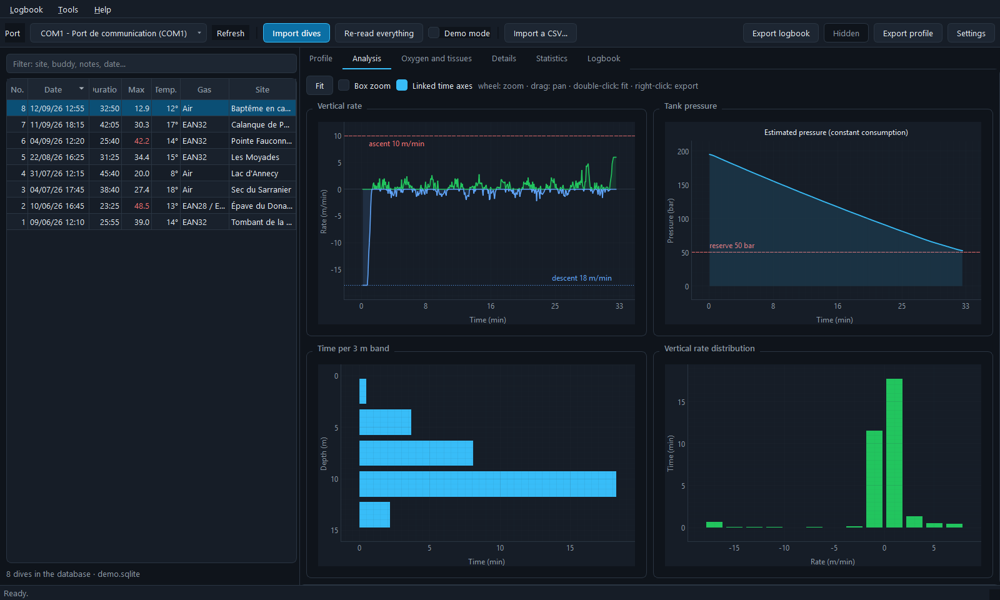
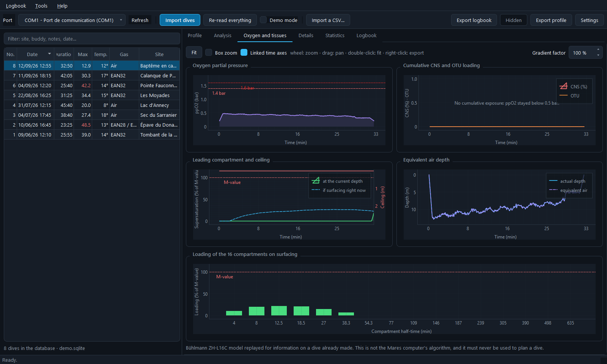
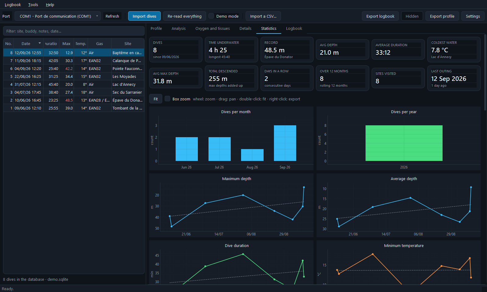
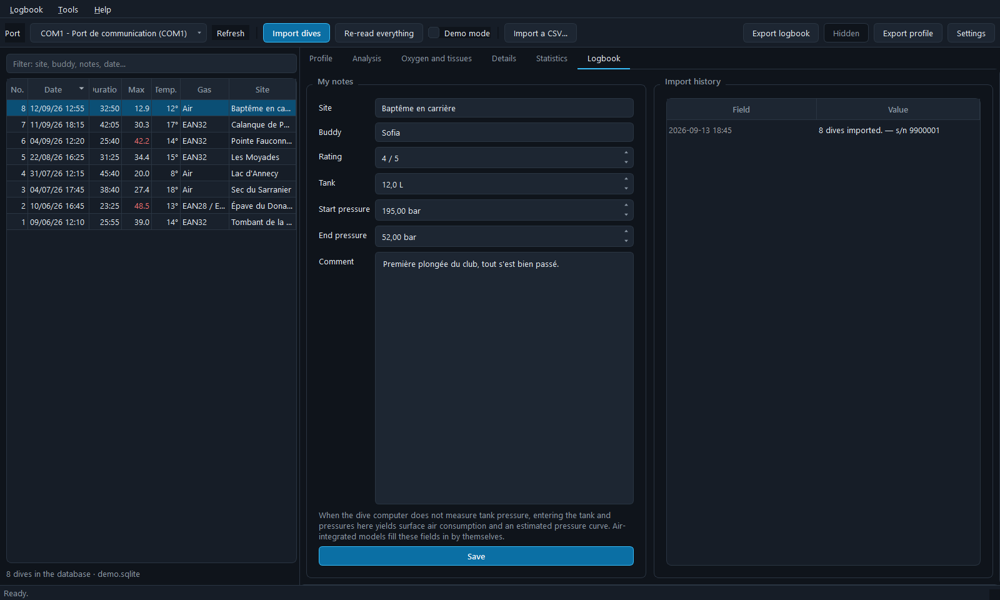
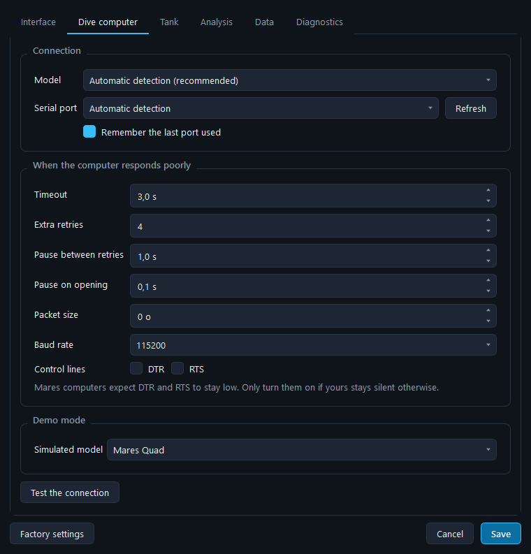
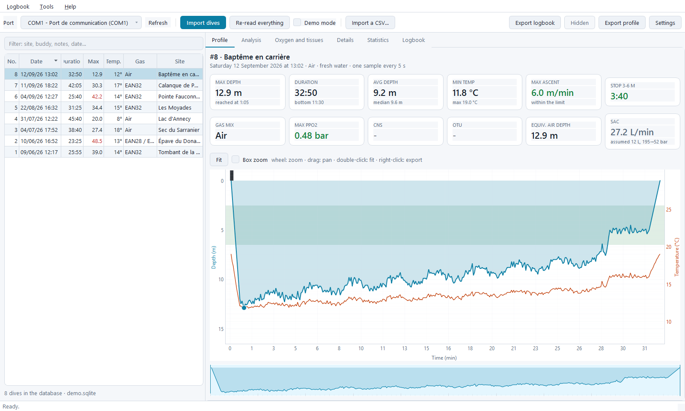
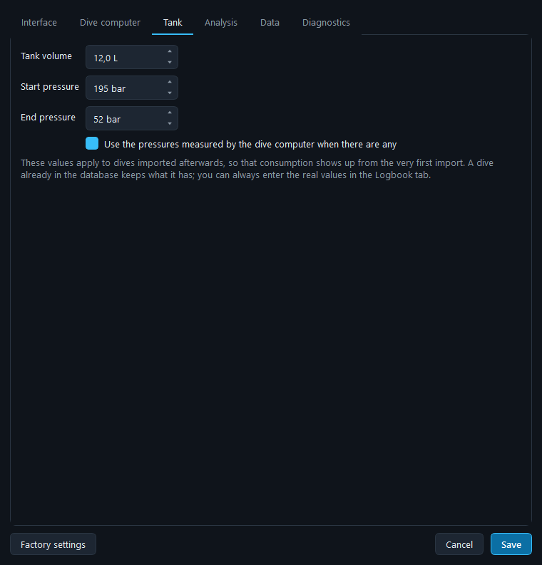

<div align="center">


# Thermocline

**A local dive logbook for Mares dive computers.**
Plug in the cable, import, analyse. No account, no online service: everything
stays on your machine.

[**Version française →**](README.md)

[](https://github.com/Pataclop/thermocline/actions/workflows/tests.yml)
[](https://github.com/Pataclop/thermocline/releases/latest)
[](LICENSE)



</div>

---

## Contents

- [Download](#download)
- [Supported dive computers](#supported-dive-computers)
- [Connecting the dive computer](#connecting-the-dive-computer)
- [The interface](#the-interface)
- [Settings](#settings)
- [Tank and consumption](#tank-and-consumption)
- [Tissue saturation](#tissue-saturation)
- [Hidden dives](#hidden-dives)
- [Data, exports and portable mode](#data-exports-and-portable-mode)
- [Command line](#command-line)
- [When it does not work](#when-it-does-not-work)
- [Installing from source](#installing-from-source)
- [Under the hood](#under-the-hood)
- [Licence](#licence)

---

## Download

Executables live in the [latest release][releases]. Nothing to install: unpack
and run.

| System | File | First launch |
|---|---|---|
| **Windows 10/11** | `Thermocline-x.y.z-windows-x86_64.zip` | SmartScreen warns that the publisher is unknown (the executable is unsigned): **More info** → **Run anyway**. |
| **macOS** (Apple Silicon) | `…-macos-arm64.zip` | Drag `Thermocline.app` into Applications, then **right-click → Open** the first time. |
| **macOS** (Intel) | `…-macos-x86_64.zip` | Same. |
| **Linux** | `…-linux-x86_64.zip` | `chmod +x Thermocline && ./Thermocline` |

Prefer the source? See [Installing from source](#installing-from-source).

[releases]: https://github.com/Pataclop/thermocline/releases/latest

---

## Supported dive computers

Twenty-two models across three families that do not speak the same language.
The model is detected on its own when you plug the cable in.

| Family | Models | How it is read |
|---|---|---|
| **IconHD** | **Quad**, **Quad Air**, Puck Pro, Puck 2, Matrix, Nemo Wide 2, Icon HD, Icon AIR | Direct flash memory read. Dives live in a ring buffer, and each record carries its header at the end. |
| **Smart** | Smart, Smart Air, Smart Apnea | Same memory, but the dive type and sample count sit at the other end of the header, and the geometry depends on the dive mode. |
| **Genius / Sirius** | Genius, Horizon, **Quad Ci**, **Quad2**, Sirius, Sirius L, Puck 4, Puck Air 2 | No memory exposed at all: the computer answers with numbered objects, and the profile is a stream of typed, CRC-protected records. |

**Air integration** — on the Icon AIR, Quad Air, Smart Air and the whole Genius
family, tank pressure is **read from the computer**. The dive card then says
"measured" where other models say "assumed".

> **Bluetooth.** The Sirius, Puck 4, Puck Air 2 and some Quad Ci only connect
> over Bluetooth. Their data format is handled here, but the application only
> speaks over a cable: those models are readable only if yours also has a wired
> port.

> **A model that is not recognised?** Open an
> [issue](https://github.com/Pataclop/thermocline/issues) with the contents of
> **Help › Diagnostics**. In the meantime,
> **Settings › Dive computer › Model** lets you force one.

---

## Connecting the dive computer

1. Clip the **Mares USB cable** onto the contacts on the back of the computer.
2. Wake the computer (press a button) and put it into data transfer mode if
   your model asks for it.
3. Pick the port in the toolbar — a `*` marks a recognised USB-to-serial
   adapter — then **Import dives**.

The cable contains a USB-to-serial adapter: **FTDI** on genuine Mares cables,
**CP210x** or **CH340** on compatible ones. If Windows does not recognise it,
install the matching driver.

The import stops as soon as it meets a dive already in the database: fetching
the last two outings reads only a few kilobytes. **Re-read everything** forces a
full re-read of the history.

---

## The interface

| Tab | What it shows |
|---|---|
| **Profile** | Depth and temperature overlaid, theoretical ceiling, gas switch markers, safety stop band, fast ascent markers. A thumbnail below the chart works as a time magnifier. |
| **Analysis** | Smoothed vertical rate, tank pressure, time per 3 m band, rate distribution. |
| **Oxygen and tissues** | ppO2 with the 1.4 / 1.6 bar thresholds, cumulative CNS and OTU, leading compartment and ceiling, equivalent air depth, loading of the 16 compartments on surfacing. |
| **Details** | Around fifty computed values, temperature against depth, and the raw data from the computer. |
| **Statistics** | 18 charts over the whole logbook: distributions, progressions, running totals, scatter plots, records. |
| **Logbook** | Site, buddy, rating, tank and pressures, comment, plus the import history. |

<table>
<tr>
<td width="50%"><br><em>Analysis — rates, pressure, distributions</em></td>
<td width="50%"><br><em>Oxygen and tissues — ppO2, CNS, OTU, compartments</em></td>
</tr>
<tr>
<td><br><em>Statistics — 18 charts over the whole logbook</em></td>
<td><br><em>Logbook — your notes, and the import history</em></td>
</tr>
</table>

### Zooming and reading

- **wheel**: zoom in / out
- **drag**: pan the view
- **double-click**: show the whole curve again
- **right-click**: pyqtgraph menu (PNG export, CSV export, scales)
- **Box zoom** checkbox: frame an area with the mouse
- **Linked time axes** checkbox: zooming one chart zooms every other one to the
  same moment of the dive
- the **read cursor** follows the mouse across every time-based chart

Hovering a chart explains what the curves show and what the thresholds mean.

---

## Settings

**Tools › Settings** (`Ctrl+,`) — six panes.



### Interface
Language (French, English, or the system's), light or dark theme, text size,
tab on startup, window position memory.


<sup>The same logbook in the light theme.</sup>

### Dive computer
Forced model, default serial port — and above all **the timings**, which are
what you reach for when a computer answers poorly:

| Setting | What it is for |
|---|---|
| **Timeout** | How long the computer is given to answer. Raise it if it stalls mid-import. |
| **Extra retries** | Retries after a lost frame. A tired cable needs more. |
| **Pause between retries** | Gives the computer time to recover. |
| **Pause on opening** | Some adapters need a moment before the first command. |
| **Packet size** | Lowering it helps with flaky cables and USB hubs. |
| **Baud rate, DTR, RTS** | Last resort only: Mares computers want 115200 baud and both lines low. |

The **Test the connection** button really connects and reports the detected
model, without writing anything to the database.

### Tank


Your usual tank and your start and end pressures. These values apply to dives
imported afterwards, so consumption shows up from the very first import —
unless the computer measures pressure itself, in which case the measurement
wins.

### Analysis
Gradient factor, maximum ascent rate, ppO2 thresholds, safety stop band and
duration, rate smoothing. These thresholds only drive the display and the
warnings: they change neither the computer's data nor its decompression.

### Data
Where the dive database and the export folder live.

### Diagnostics
Versions, paths, detected ports. This is what to copy into a request for help.

---

## Tank and consumption

Models **without air integration** do not measure pressure. Lacking a
measurement, every dive starts with the values from **Settings › Tank** — by
default 12 L, 195 bar at the start, 52 bar at the end — which are enough to show
consumption from the very first import. The dive cards say clearly that this is
an assumption.

Enter your real values in the **Logbook** tab: the mention disappears, surface
air consumption (SAC) is recomputed, and the tank pressure curve is
reconstructed from the instantaneous depth.

On models **with air integration** there is nothing to enter: the pressures come
from the computer, and the pressure curve is a measurement, not an estimate.

---

## Tissue saturation

The **Oxygen and tissues** tab replays the profile through a **Bühlmann
ZH-L16C** model with 16 compartments (nitrogen *and* helium, for trimix dives)
and shows:

- the supersaturation of the leading compartment, at the current depth;
- the one you would have **by surfacing right now** — this is what tells you
  whether a direct ascent is still possible;
- the theoretical ceiling, in metres;
- the loading of each of the 16 compartments on leaving the water;
- the estimated desaturation time.

The **gradient factor** (10 to 100 %) lowers the M-values to visualise a more
conservative margin.

> ⚠️ This model is replayed **after the fact, for information only**. It is not
> Mares' proprietary algorithm, it ignores previous dives, and it must **never**
> be used to plan a dive.

---

## Hidden dives

Right-click a dive → **Hide this dive**. It leaves the logbook and will **never
be imported again**, even by "Re-read everything".

This is meant for second-hand computers whose memory still holds the previous
owner's dives. The dive stays in the device: the **Hidden** button in the
toolbar restores it, after which "Re-read everything" brings it back.

---

## Data, exports and portable mode

- Default database: `~/.thermocline/dives.sqlite`. A logbook left by an earlier
  version in `~/.maresquad` is **picked up automatically** on first start.
- The raw bytes of every dive are kept, so decoding can be replayed after a fix
  without plugging the computer back in.
- **Export logbook**: one row per dive (CSV with `;`, UTF-8 BOM, ready for Excel
  and LibreOffice).
- **Export profile**: every computed series of the displayed dive — depth,
  temperature, gas, rate, ppO2, CNS, OTU, EAD, pressure, ceiling,
  supersaturation.
- **Import a CSV**: takes back a logbook exported from this application or from
  another one, letting you choose which dives to add.

The schema migrates on its own: a database created by an earlier version is
completed on opening, with no loss.

### Portable mode

Put an empty file named `portable.txt` next to the executable: the database and
settings are then kept in a `donnees` subfolder in the same place. Enough to
carry the logbook on a USB stick, or to use it on a machine where the home
folder is locked down.

---

## Command line

Everything the interface does, without the interface:

```bash
python -m thermocline ports                 # available serial ports
python -m thermocline models                # supported Mares models
python -m thermocline diagnostic            # versions, paths, ports
python -m thermocline import --demo         # import (--port, --limit, --full)
python -m thermocline list                  # logbook
python -m thermocline stats                 # overview
python -m thermocline stats 12              # one dive in detail
python -m thermocline hidden                # hidden dives
python -m thermocline dump memory.bin       # raw copy of the flash
```

`dump` is a diagnostic aid: it copies the computer's memory so the format can be
worked on offline (IconHD and Smart families only — the Genius family does not
expose its memory).

---

## When it does not work

| Symptom | Where to look |
|---|---|
| No port detected | The adapter driver is not installed, or the cable is not plugged in. **Help › Connecting my dive computer** walks through it. |
| "The dive computer is not responding" | The clip is not firmly seated on the contacts, or the computer went back to sleep. Wake it and try again. |
| The import stalls midway | Raise the **timeout** and the number of **retries** in Settings › Dive computer; lower the **packet size**. |
| "Unrecognised Mares model" | Force the model in Settings › Dive computer, and open an issue with the diagnostics. |
| Port busy | Close Mares Dive Organizer, Subsurface or any other program holding the port. |
| Linux: permission denied | `sudo usermod -aG dialout $USER`, then log out and back in. |
| macOS: the cable does not show up | Install the CP210x or CH340 driver and allow it in System Settings › Privacy & Security. |

**Help › Diagnostics** gathers versions, paths and ports: it is the first thing
to attach to a request for help.

---

## Installing from source

Python 3.10 or newer.

```bash
git clone https://github.com/Pataclop/thermocline.git
cd thermocline
pip install -r requirements.txt
python run.py
```

To try it without hardware — eight dives fabricated in the real binary format:

```bash
python run.py --demo
```

To build the executable for your own system:

```bash
pip install pyinstaller pillow
python tools/build.py
```

### Tests

```bash
python -m unittest discover -s tests -t .
```

92 tests, with no hardware and no display. `tests/test_protocol.py` replays the
byte-by-byte dialogue against fake in-memory dive computers — all three
families, packet splitting, recovery from a corrupted frame, walking the ring
buffer including wrap-around, reassembling segmented Genius objects, stopping on
a known fingerprint. `tests/test_parser.py` checks decoding by round trip,
`tests/test_storage.py` covers deduplication, hiding and schema migration, and
`tests/test_translations.py` makes sure no text was forgotten in the English
catalogue.

---

## Under the hood

### The protocol in brief

Serial link at 115200 baud, 8 bits, **even parity**, 1 stop bit, DTR and RTS
low. Every command follows the same frame, whatever the family:

```
host  →  [cmd, cmd ^ 0xA5]
host  ←  [0xAA]              acknowledgement
host  →  [payload]           if the command has one
host  ←  [answer]
host  ←  [0xEA]              end of frame
```

**IconHD and Smart families.** Profiles live in a **ring buffer** walked
backwards from an end pointer. Each record is
`[length][samples][header]`. A dive's fingerprint is its encoded date and time:
that is both the deduplication key and the stopping point of an import.

**Genius family.** The computer exposes numbered **objects**: model, serial
number, dive count, then a header and a profile for each dive. Long payloads
arrive in alternating segments. The profile is a stream of typed records —
`DSTR` start, `DPRS` sample, `AIRS` tank pressure, `DEND` end — each closed by a
CRC-16/CCITT and a repeat of its own type.

### Layout

```
thermocline/
  transport.py       serial link, port detection
  device.py          Mares protocols: flash, Smart, Genius objects
  parser.py          decoding a record into objects
  simulator.py       simulated dive computers, in the real binary format
  storage.py         SQLite schema, deduplication, hiding
  analytics.py       per-dive and whole-logbook statistics
  deco.py            Bühlmann ZH-L16C model (nitrogen and helium)
  config.py          preferences, portable mode, diagnostics
  i18n.py            translation machinery
  translations.py    French → English catalogue
  dates.py           dates spelled out, without relying on the locale
  importer.py        import orchestration
  cli.py             command line
  ui/                PyQt6 + pyqtgraph interface
tools/
  build.py           executable build
  make_icon.py       icon drawing
  screenshots.py     the screenshots in this README
```

---

## Licence

`thermocline/device.py` and `thermocline/parser.py` are ports of
`mares_iconhd.c` and `mares_iconhd_parser.c` from
[libdivecomputer](https://libdivecomputer.org/), published under **LGPL 2.1**.
This work derives from them, so the project is distributed under the
[same licence](LICENSE).

Thanks to Jef Driesen and the libdivecomputer contributors, without whose
reverse-engineering none of this would be readable.
