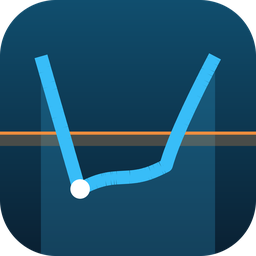
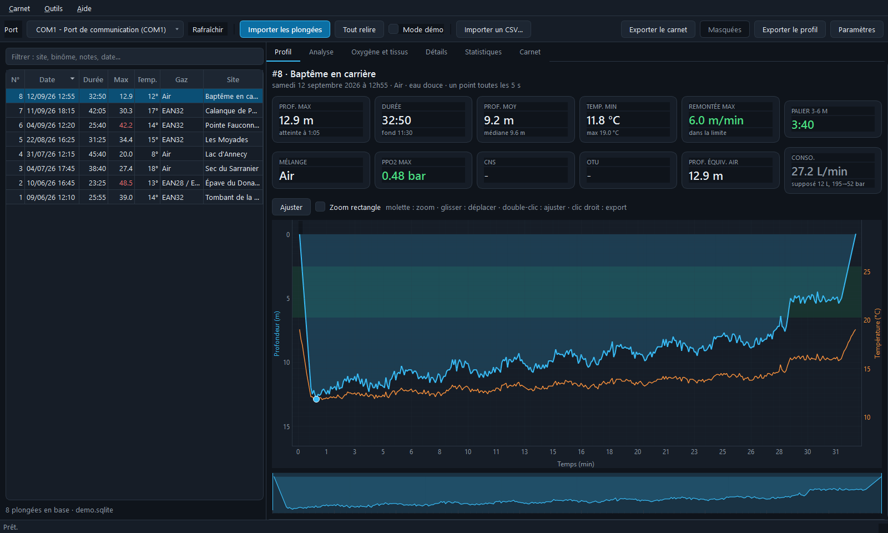
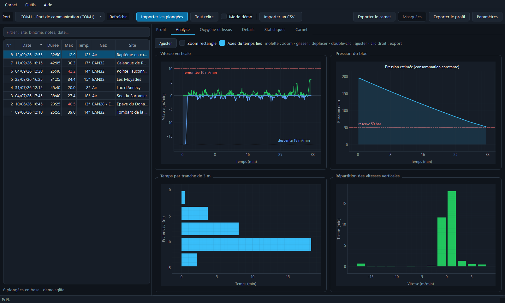
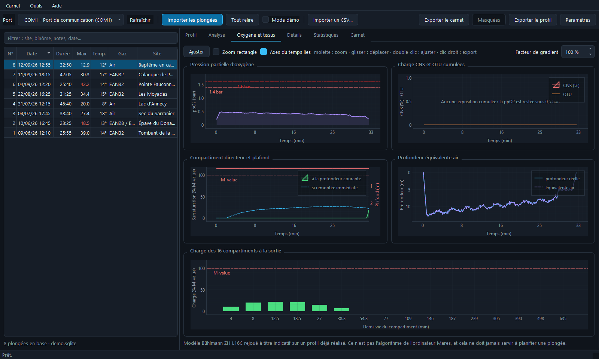
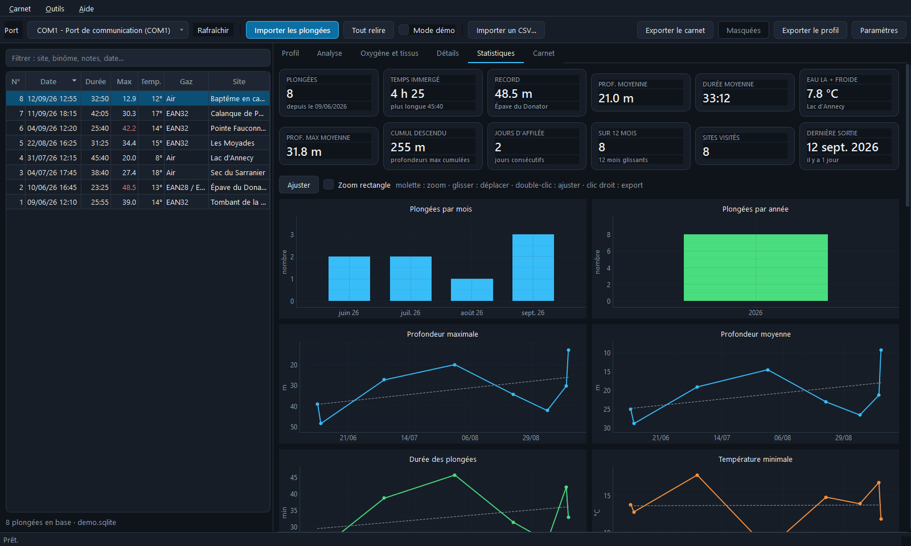
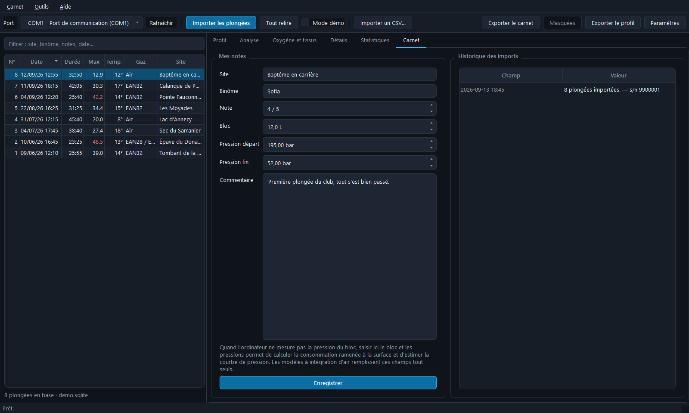
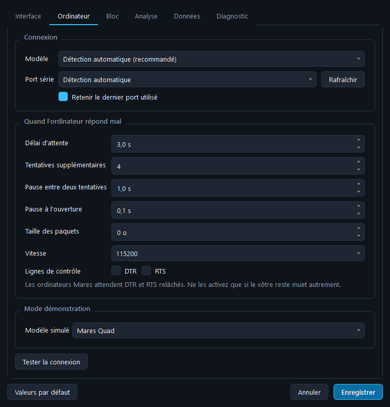
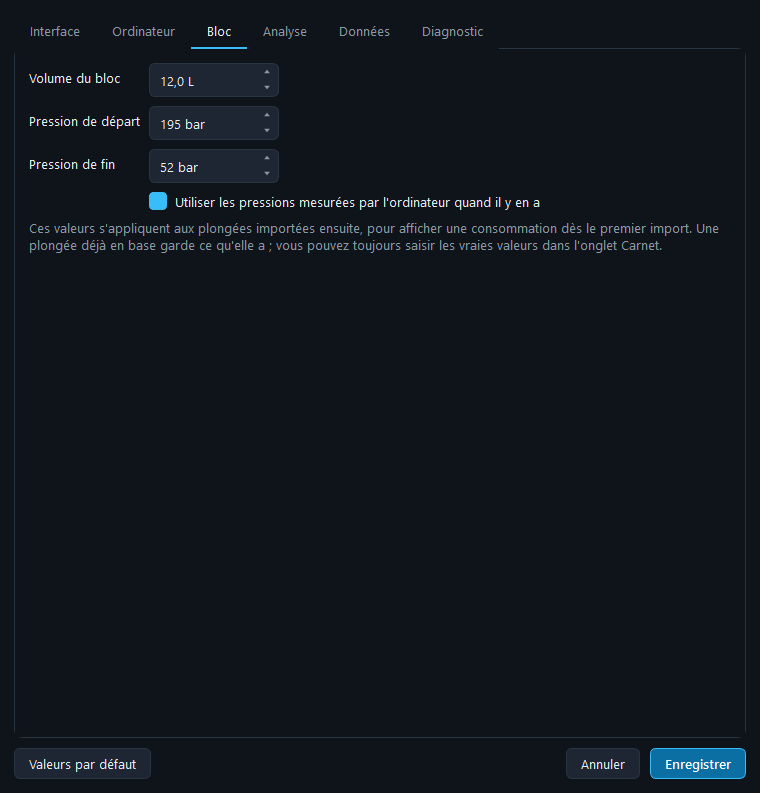

<div align="center">



# Thermocline

**Carnet de plongée local pour les ordinateurs Mares.**
Branchez le câble, importez, analysez. Aucun compte, aucun service en ligne :
tout reste sur votre machine.

[**English version →**](README.en.md)

[](https://github.com/Pataclop/thermocline/actions/workflows/tests.yml)
[](https://github.com/Pataclop/thermocline/releases/latest)
[](LICENSE)



</div>

---

## Sommaire

- [Télécharger](#télécharger)
- [Ordinateurs gérés](#ordinateurs-gérés)
- [Brancher l'ordinateur](#brancher-lordinateur)
- [L'interface](#linterface)
- [Paramètres](#paramètres)
- [Bloc et consommation](#bloc-et-consommation)
- [Saturation des tissus](#saturation-des-tissus)
- [Plongées masquées](#plongées-masquées)
- [Données, exports et mode portable](#données-exports-et-mode-portable)
- [Ligne de commande](#ligne-de-commande)
- [Quand ça ne marche pas](#quand-ça-ne-marche-pas)
- [Installer depuis les sources](#installer-depuis-les-sources)
- [Sous le capot](#sous-le-capot)
- [Licence](#licence)

---

## Télécharger

Les exécutables sont dans la [dernière version publiée][releases]. Rien à
installer : on décompresse et on lance.

| Système | Fichier | Première ouverture |
|---|---|---|
| **Windows 10/11** | `Thermocline-x.y.z-windows-x86_64.zip` | SmartScreen prévient que l'éditeur est inconnu (l'exécutable n'est pas signé) : **Informations complémentaires** → **Exécuter quand même**. |
| **macOS** (Apple Silicon) | `…-macos-arm64.zip` | Glissez `Thermocline.app` dans Applications, puis **clic droit → Ouvrir** la première fois. |
| **macOS** (Intel) | `…-macos-x86_64.zip` | Idem. |
| **Linux** | `…-linux-x86_64.zip` | `chmod +x Thermocline && ./Thermocline` |

Vous préférez les sources ? Voir
[Installer depuis les sources](#installer-depuis-les-sources).

[releases]: https://github.com/Pataclop/thermocline/releases/latest

---

## Ordinateurs gérés

Vingt-deux modèles, répartis en trois familles qui ne parlent pas la même
langue. Le modèle est reconnu tout seul au branchement.

| Famille | Modèles | Comment ça se lit |
|---|---|---|
| **IconHD** | **Quad**, **Quad Air**, Puck Pro, Puck 2, Matrix, Nemo Wide 2, Icon HD, Icon AIR | Lecture directe de la mémoire flash. Les plongées vivent dans un buffer circulaire, l'en-tête est à la fin de chaque enregistrement. |
| **Smart** | Smart, Smart Air, Smart Apnea | Même mémoire, mais le type de plongée et le nombre d'échantillons sont rangés à l'autre bout de l'en-tête, et la géométrie dépend du mode. |
| **Genius / Sirius** | Genius, Horizon, **Quad Ci**, **Quad2**, Sirius, Sirius L, Puck 4, Puck Air 2 | Plus de mémoire exposée du tout : l'ordinateur répond par objets numérotés, et le profil est une suite d'enregistrements typés protégés par un CRC. |

**Intégration d'air** — sur l'Icon AIR, le Quad Air, le Smart Air et toute la
famille Genius, la pression du bloc est **lue dans l'ordinateur**. La fiche
affiche alors « mesuré » là où les autres modèles affichent « supposé ».

> **Bluetooth.** Les Sirius, Puck 4, Puck Air 2 et certains Quad Ci ne se
> connectent qu'en Bluetooth. Leur format de données est géré ici, mais
> l'application ne parle que par câble : ces modèles ne sont lisibles que si
> le vôtre dispose aussi d'un port filaire.

> **Un modèle qui n'est pas reconnu ?** Ouvrez une
> [issue](https://github.com/Pataclop/thermocline/issues) avec le contenu de
> **Aide › Diagnostic**. En attendant, **Paramètres › Ordinateur › Modèle**
> permet d'en forcer un.

---

## Brancher l'ordinateur

1. Clipsez le **câble USB Mares** sur les contacts au dos de l'ordinateur.
2. Réveillez l'ordinateur (appuyez sur un bouton) et mettez-le en mode
   transfert de données si votre modèle le demande.
3. Choisissez le port dans la barre d'outils — un `*` signale un convertisseur
   USB-série reconnu — puis **Importer les plongées**.

Le câble contient un convertisseur USB-série : **FTDI** sur les câbles
d'origine, **CP210x** ou **CH340** sur les compatibles. Si Windows ne le
reconnaît pas, installez le pilote correspondant.

L'import s'arrête dès qu'il rencontre une plongée déjà en base : ramener les
deux dernières sorties ne lit que quelques kilo-octets. **Tout relire** force
la relecture de l'historique complet.

---

## L'interface

| Onglet | Contenu |
|---|---|
| **Profil** | Profondeur et température superposées, plafond théorique, repères de changement de gaz, bande du palier de sécurité, marqueurs de remontée trop rapide. Une vignette sous le graphique sert de loupe temporelle. |
| **Analyse** | Vitesse verticale lissée, pression du bloc, temps par tranche de 3 m, répartition des vitesses. |
| **Oxygène et tissus** | ppO2 avec les seuils 1,4 / 1,6 bar, CNS et OTU cumulés, compartiment directeur et plafond, profondeur équivalente air, charge des 16 compartiments à la sortie. |
| **Détails** | Une cinquantaine de valeurs calculées, la température en fonction de la profondeur, et les données brutes de l'ordinateur. |
| **Statistiques** | 18 graphiques sur l'ensemble du carnet : répartitions, progressions, cumuls, nuages de points, records. |
| **Carnet** | Site, binôme, note, bloc et pressions, commentaire, plus l'historique des imports. |

<table>
<tr>
<td width="50%"><br><em>Analyse — vitesses, pression, répartitions</em></td>
<td width="50%"><br><em>Oxygène et tissus — ppO2, CNS, OTU, compartiments</em></td>
</tr>
<tr>
<td><br><em>Statistiques — 18 graphiques sur tout le carnet</em></td>
<td><br><em>Carnet — vos notes, et l'historique des imports</em></td>
</tr>
</table>

### Zoom et lecture

- **molette** : zoomer / dézoomer
- **glisser** : déplacer la vue
- **double-clic** : réafficher toute la courbe
- **clic droit** : menu pyqtgraph (export PNG, export CSV, échelles)
- case **Zoom rectangle** : encadrer une zone à la souris
- case **Axes du temps liés** : zoomer un graphique zoome tous les autres au
  même instant de la plongée
- le **curseur de lecture** suit la souris sur tous les graphiques temporels

Passer la souris sur un graphique affiche une explication de ce que montrent
les courbes et à quoi correspondent les seuils.

---

## Paramètres

**Outils › Paramètres** (`Ctrl+,`) — six volets.



### Interface
Langue (français, anglais, ou celle du système), thème clair ou sombre, taille
du texte, onglet d'ouverture, mémoire de la position de la fenêtre.

### Ordinateur
Modèle forcé, port série par défaut — et surtout **les délais**, qui sont ce
qu'on règle quand un ordinateur répond mal :

| Réglage | À quoi ça sert |
|---|---|
| **Délai d'attente** | Temps laissé à l'ordinateur pour répondre. À augmenter s'il se bloque en cours d'import. |
| **Tentatives supplémentaires** | Reprises après une trame perdue. Un câble fatigué en demande plus. |
| **Pause entre deux tentatives** | Laisse le temps à l'ordinateur de se remettre. |
| **Pause à l'ouverture** | Certains convertisseurs ont besoin d'un instant avant la première commande. |
| **Taille des paquets** | La réduire aide sur les câbles capricieux et les concentrateurs USB. |
| **Vitesse, DTR, RTS** | À ne toucher qu'en dernier recours : les ordinateurs Mares veulent 115200 bauds et les deux lignes relâchées. |

Le bouton **Tester la connexion** se connecte vraiment et affiche le modèle
détecté, sans rien écrire en base.

### Bloc


Votre bloc habituel et vos pressions de départ et de fin. Ces valeurs
s'appliquent aux plongées importées ensuite, pour afficher une consommation dès
le premier import — sauf si l'ordinateur mesure lui-même la pression, auquel
cas c'est la mesure qui gagne.

### Analyse
Facteur de gradient, vitesse de remontée maximale, seuils ppO2, bande et durée
du palier de sécurité, lissage des vitesses. Ces seuils ne servent qu'à
l'affichage et aux alertes : ils ne modifient ni les données de l'ordinateur,
ni sa décompression.

### Données
Emplacement de la base de plongées et du dossier d'export.

### Diagnostic
Versions, chemins, ports détectés. C'est ce qu'il faut copier dans une demande
d'aide.

---

## Bloc et consommation

Les modèles **sans intégration d'air** ne mesurent pas la pression. Faute de
mesure, chaque plongée démarre avec les valeurs de
**Paramètres › Bloc** — par défaut 12 L, 195 bar au départ, 52 bar en sortie —
qui permettent d'afficher une consommation dès le premier import. Les fiches
signalent clairement qu'il s'agit d'une hypothèse.

Saisissez vos vraies valeurs dans l'onglet **Carnet** : la mention disparaît, la
consommation ramenée à la surface (SAC) est recalculée, et la courbe de pression
du bloc est reconstituée à partir de la profondeur instantanée.

Sur les modèles **avec intégration d'air**, rien à saisir : les pressions
viennent de l'ordinateur, et la courbe de pression est une mesure, pas une
estimation.

---

## Saturation des tissus

L'onglet **Oxygène et tissus** rejoue le profil dans un modèle **Bühlmann
ZH-L16C** à 16 compartiments (azote *et* hélium, pour les plongées trimix) et
affiche :

- la sursaturation du compartiment directeur, à la profondeur courante ;
- celle qu'on aurait **en remontant immédiatement** — c'est elle qui indique si
  la remontée directe reste possible ;
- le plafond théorique, en mètres ;
- la charge de chacun des 16 compartiments à la sortie de l'eau ;
- le temps de désaturation estimé.

Le **facteur de gradient** (10 à 100 %) abaisse les M-values pour visualiser une
marge plus conservatrice.

> ⚠️ Ce modèle est rejoué **après coup, à titre informatif**. Ce n'est pas
> l'algorithme propriétaire de Mares, il ne tient pas compte des plongées
> précédentes, et il ne doit **jamais** servir à planifier une plongée.

---

## Plongées masquées

Clic droit sur une plongée → **Masquer cette plongée**. Elle quitte le carnet et
ne sera **plus jamais réimportée**, même avec « Tout relire ».

C'est fait pour les ordinateurs d'occasion, dont la mémoire contient encore les
plongées de l'ancien propriétaire. La plongée reste dans l'appareil : le bouton
**Masquées** de la barre d'outils permet de la restaurer, après quoi un
« Tout relire » la ramène.

---

## Données, exports et mode portable

- Base par défaut : `~/.thermocline/dives.sqlite`. Un carnet laissé par une
  version antérieure dans `~/.maresquad` est **repris automatiquement** au
  premier démarrage.
- Les octets bruts de chaque plongée sont conservés, ce qui permet de rejouer le
  décodage après correction sans rebrancher l'ordinateur.
- **Exporter le carnet** : une ligne par plongée (CSV `;`, UTF-8 BOM, prêt pour
  Excel et LibreOffice).
- **Exporter le profil** : toutes les séries calculées de la plongée affichée —
  profondeur, température, gaz, vitesse, ppO2, CNS, OTU, PEA, pression, plafond,
  sursaturation.
- **Importer un CSV** : reprend un carnet exporté depuis cette application ou
  depuis un autre logiciel, en vous laissant choisir les plongées à ajouter.

Le schéma migre tout seul : une base créée par une version antérieure est
complétée à l'ouverture, sans perte.

### Mode portable

Posez un fichier vide nommé `portable.txt` à côté de l'exécutable : la base et
les réglages sont alors rangés dans un sous-dossier `donnees` au même endroit.
De quoi emporter le carnet sur une clé USB, ou l'utiliser sur un poste où le
dossier personnel est verrouillé.

---

## Ligne de commande

Tout ce que fait l'interface, sans l'interface :

```bash
python -m thermocline ports                 # ports série disponibles
python -m thermocline models                # modèles Mares gérés
python -m thermocline diagnostic            # versions, chemins, ports
python -m thermocline import --demo         # import (--port, --limit, --full)
python -m thermocline list                  # carnet
python -m thermocline stats                 # vue d'ensemble
python -m thermocline stats 12              # fiche d'une plongée
python -m thermocline hidden                # plongées masquées
python -m thermocline dump memoire.bin      # copie brute de la flash
```

`dump` sert au diagnostic : il recopie la mémoire de l'ordinateur pour
travailler le format hors ligne (familles IconHD et Smart uniquement — la
famille Genius n'expose pas sa mémoire).

---

## Quand ça ne marche pas

| Symptôme | Piste |
|---|---|
| Aucun port détecté | Le pilote du convertisseur n'est pas installé, ou le câble n'est pas branché. **Aide › Brancher mon ordinateur** rappelle la marche à suivre. |
| « L'ordinateur ne répond pas » | Le clip n'est pas bien enfoncé sur les contacts, ou l'ordinateur s'est rendormi. Réveillez-le et relancez. |
| L'import se bloque en route | Augmentez le **délai d'attente** et le nombre de **tentatives** dans Paramètres › Ordinateur ; réduisez la **taille des paquets**. |
| « Modèle Mares non reconnu » | Forcez le modèle dans Paramètres › Ordinateur, et ouvrez une issue avec le diagnostic. |
| Port occupé | Fermez Mares Dive Organizer, Subsurface ou tout autre logiciel qui tiendrait le port. |
| Linux : permission refusée | `sudo usermod -aG dialout $USER`, puis rouvrez votre session. |
| macOS : le câble n'apparaît pas | Installez le pilote CP210x ou CH340 et autorisez-le dans Réglages Système › Confidentialité et sécurité. |

**Aide › Diagnostic** rassemble versions, chemins et ports : c'est la première
chose à joindre à une demande d'aide.

---

## Installer depuis les sources

Python 3.10 ou plus récent.

```bash
git clone https://github.com/Pataclop/thermocline.git
cd thermocline
pip install -r requirements.txt
python run.py
```

Pour essayer sans matériel — huit plongées fabriquées au format binaire réel :

```bash
python run.py --demo
```

Fabriquer l'exécutable de votre système :

```bash
pip install pyinstaller pillow
python tools/build.py
```

### Tests

```bash
python -m unittest discover -s tests -t .
```

92 tests, sans matériel ni affichage. `tests/test_protocol.py` rejoue le
dialogue octet par octet contre de faux ordinateurs en mémoire — les trois
familles, le découpage en paquets, la reprise sur trame corrompue, le parcours
du buffer circulaire y compris lors du bouclage, le réassemblage des objets
Genius en segments, l'arrêt sur empreinte connue. `tests/test_parser.py` vérifie
le décodage par aller-retour, `tests/test_storage.py` la déduplication, le
masquage et la migration de schéma, et `tests/test_translations.py` qu'aucun
texte n'a été oublié dans le catalogue anglais.

---

## Sous le capot

### Le protocole en bref

Liaison série 115200 bauds, 8 bits, **parité paire**, 1 bit de stop, DTR et RTS
relâchés. Chaque commande suit la même trame, quelle que soit la famille :

```
hôte  →  [cmd, cmd ^ 0xA5]
hôte  ←  [0xAA]              acquittement
hôte  →  [charge utile]      si la commande en a une
hôte  ←  [réponse]
hôte  ←  [0xEA]              fin de trame
```

**Familles IconHD et Smart.** Les profils vivent dans un **buffer circulaire**
parcouru à reculons depuis un pointeur de fin. Chaque enregistrement est
`[longueur][échantillons][en-tête]`. L'empreinte d'une plongée est sa date/heure
encodée : c'est la clé de déduplication et le point d'arrêt de l'import.

**Famille Genius.** L'ordinateur expose des **objets** numérotés : modèle,
numéro de série, nombre de plongées, puis pour chaque plongée une en-tête et un
profil. Les charges utiles longues arrivent en segments alternés. Le profil est
une suite d'enregistrements typés — `DSTR` début, `DPRS` échantillon, `AIRS`
pression du bloc, `DEND` fin — chacun terminé par un CRC-16/CCITT et une
répétition de son type.

### Structure

```
thermocline/
  transport.py       liaison série, détection des ports
  device.py          protocoles Mares : flash, Smart, objets Genius
  parser.py          décodage d'un enregistrement en objets
  simulator.py       ordinateurs simulés, au format binaire réel
  storage.py         schéma SQLite, déduplication, masquage
  analytics.py       statistiques d'une plongée et du carnet
  deco.py            modèle Bühlmann ZH-L16C (azote et hélium)
  config.py          préférences, mode portable, diagnostic
  i18n.py            mécanique de traduction
  translations.py    catalogue français → anglais
  dates.py           dates en toutes lettres, sans dépendre de la locale
  importer.py        orchestration de l'import
  cli.py             ligne de commande
  ui/                interface PyQt6 + pyqtgraph
tools/
  build.py           fabrication de l'exécutable
  make_icon.py       dessin de l'icône
  screenshots.py     captures d'écran de ce README
```

---

## Licence

`thermocline/device.py` et `thermocline/parser.py` sont des portages de
`mares_iconhd.c` et `mares_iconhd_parser.c` de
[libdivecomputer](https://libdivecomputer.org/), publiés sous **LGPL 2.1**. Ce
travail en dérive : le projet est donc distribué sous la
[même licence](LICENSE).

Merci à Jef Driesen et aux contributeurs de libdivecomputer, sans le travail de
rétro-ingénierie desquels rien de tout cela ne serait lisible.
